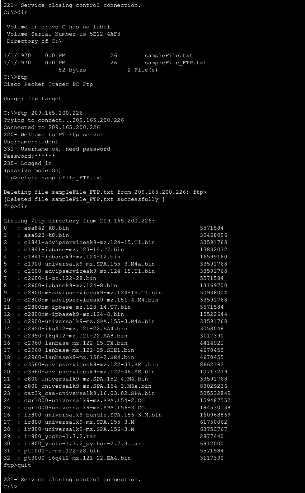
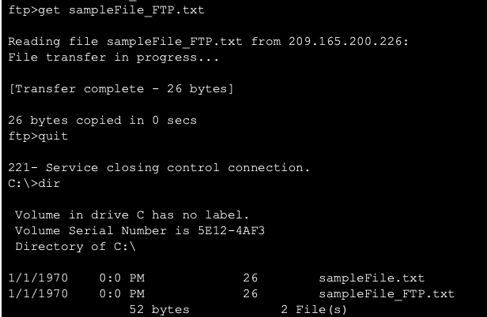
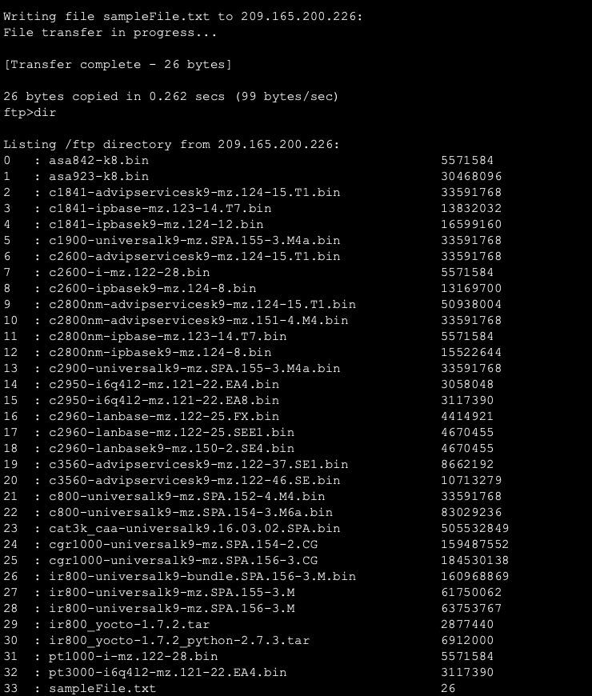
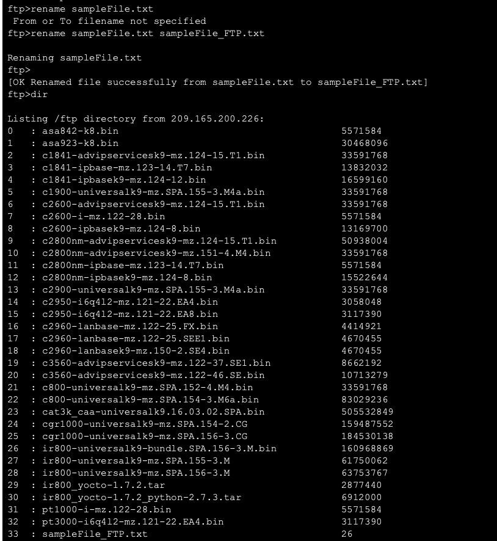

# Packet Tracer - Use FTP Services

## Objective

Demonstrate how File Transfer Protocol (FTP) is used to transfer files between a client and an FTP server.

The lab involved connecting to an FTP server, uploading a file, renaming the file, downloading it back to the client, and deleting the file from the server.

## Addressing

| Device               | Interface | IP Address        | Subnet Mask       |
| -------------------- | --------- | ----------------- | ----------------- |
| FTP Server (ftp.pka) | NIC       | `209.165.200.226` | `255.255.255.224` |

## FTP Credentials

* **Username:** `student`
* **Password:** `class`

## FTP Ports

|   Port | Purpose                        |
| -----: | ------------------------------ |
| **21** | FTP command/control connection |
| **20** | FTP data transfer              |

## Tasks Completed

### 1. Locate the File

On PC-A, I opened the Command Prompt and used the `dir` command to view the files stored on the computer.

The file `sampleFile.txt` was located in the `C:\` directory.

```text
C:\> dir
```

### 2. Connect to the FTP Server

I connected PC-A to the FTP server using its IP address:

```text
C:\> ftp 209.165.200.226
```

I then authenticated using the provided FTP credentials.

```text
Username: student
Password: class
```

The server successfully authenticated the user and established the FTP session.

### 3. View Available FTP Commands

I used the following command to display the available FTP commands:

```text
ftp> ?
```

This displayed commands such as `dir`, `get`, `put`, `delete`, `rename`, and `quit`.

### 4. View Files on the FTP Server

I used:

```text
ftp> dir
```

to display the files available on the FTP server.

### 5. Upload a File

I uploaded `sampleFile.txt` from PC-A to the FTP server using:

```text
ftp> put sampleFile.txt
```

The transfer completed successfully.

### 6. Verify the Uploaded File

I used:

```text
ftp> dir
```

again to verify that `sampleFile.txt` had been successfully uploaded to the FTP server.

### 7. Rename the File

I renamed the uploaded file on the FTP server using:

```text
ftp> rename sampleFile.txt sampleFile_FTP.txt
```

I then used `dir` to verify that the file had been renamed successfully.

### 8. Download the File

I downloaded the renamed file back to PC-A using:

```text
ftp> get sampleFile_FTP.txt
```

The transfer completed successfully.

### 9. Delete the File

I connected to the FTP server again and removed the file using:

```text
ftp> delete sampleFile_FTP.txt
```

The file was successfully deleted from the FTP server.

### 10. Close the FTP Session

I used:

```text
ftp> quit
```

to terminate the FTP session.

## FTP Commands Practiced

| Command              | Purpose                          |
| -------------------- | -------------------------------- |
| `dir`                | Lists files and directories      |
| `ftp <IP address>`   | Connects to an FTP server        |
| `?`                  | Displays available FTP commands  |
| `put <filename>`     | Uploads a file to the server     |
| `get <filename>`     | Downloads a file from the server |
| `rename <old> <new>` | Renames a file                   |
| `delete <filename>`  | Deletes a file from the server   |
| `quit`               | Exits the FTP client             |

## Observations

The lab demonstrated the client-server nature of FTP. PC-A acted as the FTP client while the FTP server provided the file transfer service.

The FTP session used a command/control connection on port 21, while port 20 is used for FTP data transfer.

The `put` command was used to upload a file, while the `get` command was used to download a file. The `rename` and `delete` commands demonstrated that files could also be managed remotely on the FTP server.

## Key Takeaways

This lab helped me understand how FTP enables file transfers between networked devices.

I learned how to:

* Establish an FTP connection.
* Authenticate with an FTP server.
* Upload files using `put`.
* Download files using `get`.
* View files using `dir`.
* Rename files using `rename`.
* Delete files using `delete`.
* Terminate an FTP session using `quit`.

The overall process can be summarized as:

**FTP Client → Connect → Authenticate → Upload/Download → Manage Files → Disconnect**

## Lab Files

* `use-ftp-services.pkt` — Cisco Packet Tracer lab file
* `screenshots/` — Screenshots showing the different stages of the FTP exercise


## Screenshots 

### 1. dir ftp server files


### 2. get 


### 3. put 


### 4. rename



